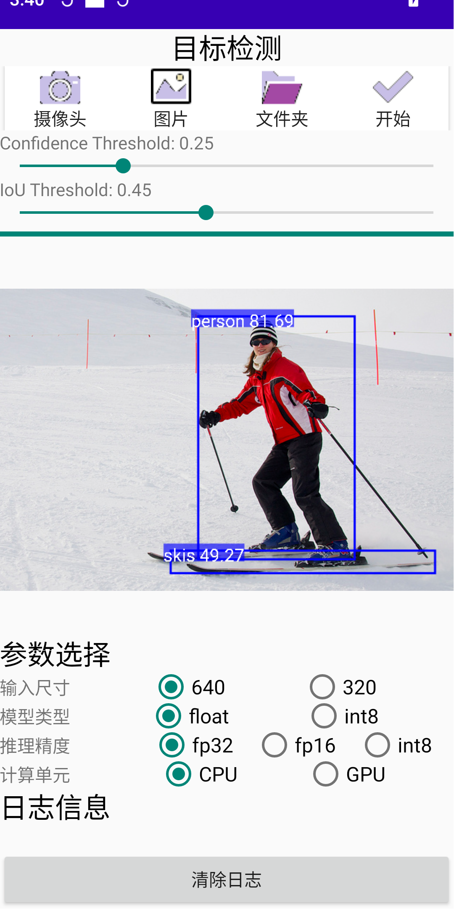

# AndroidDetector🚀
在安卓系统使用的目标检测器，支持摄像头、图片、文件夹输入，精度速度测试
# 界面

# 环境
* Android Studio 4.2.1
* minSdkVersion 28
* targetSdkVersion 29
* Android Device：Snapdragon 778G
# Error & Solution
| Error | Solution |
| ------------- | -------- |
| No variants found for ':app'| 更改tools版本:https://blog.csdn.net/chenhao0568/article/details/117754675 |
| Unsupported Java| 修改JDK版本:https://blog.csdn.net/hehota/article/details/130514341 |
